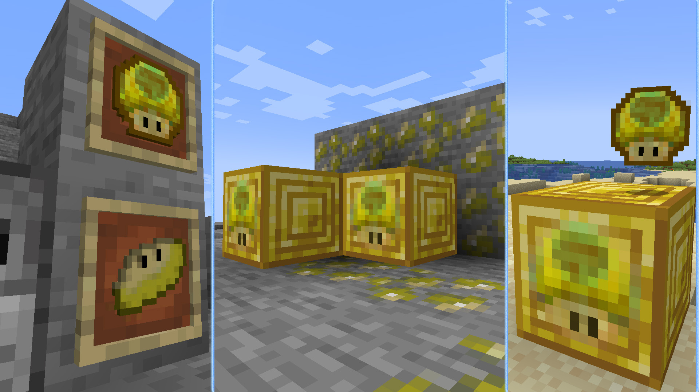

# Fungui Coin

---

## What Is This?
- **Fungui** is a private minecraft server, started a few years ago with only 8-15 members. For Fungui season 3 we're adding a currency system.
- **Fungui Coin** is a fabric mod adding some custom items and blocks. including: 
  - FunguiCoin and raw FunguiCoin items.
  - Fungui Piece and FunguiCoin Ore.
  - recipes to convert FunguiCoin To Fungui Piece.[^1] 
  - smelting raw FunguiCoin to FunguiCoin

  


---
## How Can I Create My Own?

- Block Modules and Items are created with **[Blockbench](https://www.blockbench.net/)**, I personally prefer this tool for creating my custom modules. It's beginner friendly and really easy to use.
- For coding I suggest you watch **[this](https://www.youtube.com/watch?v=RSqSZoJQXvg&list=PLKGarocXCE1EeLZggaXPJaARxnAbUD8Y_)** youtube tutorial.[^2]

---
## How Do I Extract The .jar File?

1. clone this repository.
   - open your console and type:
      ```shell
      git clone https://github.com/Luhdo/Fungui_Coin
      ```
2. navigate your way to the clone you just created.
   - in the console:
     ```shell
     cd Fungui_Coin
     ```
3. build the file
   - in the console:
     ```shell
     ./gradlew build
     ```

---
## Is This Mod Server Side?
No! but I look forward to anyone that could contribute to me making it happen.


[^1]: **1** Fungui Piece = **9** FunguiCoin, also the reverse.
[^2]: If you don't know Java, thats good! keep it that way! but if you want to learn it, you can watch **[THIS](https://www.youtube.com/watch?v=oBwPZRk6-SE&list=PLKGarocXCE1FeXvEogpjz4SvHxF_FJRO6)** playlist.
